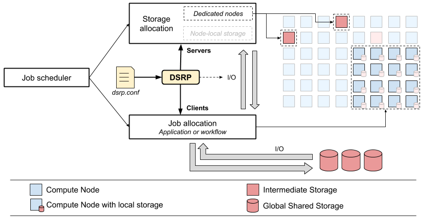

# Ansible-powered Dynamic Storage Resource Provisioning (DSRP)

It is common for HPC systems to provide dynamic access to compute nodes
through a batch scheduler. However, little has been done for dynamically
provisioned storage resources. Such resources are traditionally shared among
all users. A dynamic provisioning mechanism allows to allocate dedicated
resources to an application or a workflow and deploy an appropriate data
manager on top of it.

We introduce here an [Ansible](https://www.ansible.com/)-powered dynamic storage resource provisioning
(DSRP) mechanism that can use intermediate storage to set up on-demand a data
manager like, for instance, a parallel file system, an object store or a
database. As Ansible has been designed for flexible deployment of services, 
we use this software to manager clients and servers of the requested data
manager. A job-scheduler-agnostic script associated with a configuration file
describing how to use the storage resources is in charge of the deployment
process. To minimize the footprint on the target resources (privileges), all
the data managers we support are containerized and launched with a container
engine for HPC systems. The figure below presents the general functioning of
DSRP.



## Requirements

  * Python 3
  * Ansible 2.x.x
  * python-hostlist
  * A container engine for HPC (see
    [Sarus](https://sarus.readthedocs.io/en/latest/)) 

### Install recent Ansible and python packages without root acccess

DSRP requires a quite recent version of Ansible installed on the HPC system's
login nodes. In case your version of Ansible is too old (<2.x.x), it is
necessary to set up a virtual environment and install all the Python packages
required for DSRP. While being in the DSRP root directory, you can proceed like this:

``` shell
git clone https://github.com/eth-cscs/dynamic-resource-provisioning.git
cd dynamic-resource-provisioning
pip install --user virtualenv
virtualenv -p python3 ENV
source ./ENV/bin/activate
pip install ansible python-hostlist
```

Now, a call to `ansible --version` should show a more recent release of the
automation tool (on Nov. 19th 2019: v. 2.9.1). Please keep in mind that in
case you need to run things manually using this virtual environment, a call to
`source ./ENV/bin/activate` is necessary for each newly open session.

The script in charge of deploying the configured data manager across the
storage resources dynamically loads this virtual environment.

## Using DSRP

### Heterogenous allocation

We will focus here on a case where two allocations are required: one with
intermediate storage nodes and one with compute nodes. There are different
ways to get two allocations running in parallel. The most convenient one is
called "heterogeneous allocation". A job scheduler like
[SLURM](https://slurm.schedmd.com/heterogeneous_jobs.html) can do that. It
consists of requesting all the resources in a single call. This can be done
through an interactive session (`salloc` with SLURM) or be means of a batch
script (submitted with `sbatch` for instance). The following examples, based
on SLURM, illustrates how to get an heterogeneous allocation. It has to be
noted that storage nodes have to be allocatable (See
[1](http://www.francoistessier.info/documents/CUG2019.pdf)).

#### Interactive session

Here, two dependent allocations are requested: 128 computes nodes on the
multicore queue (mc) and 2 storage nodes each featuring SSDs.

``` shell
user@login-mode:~$ salloc -A<project> -N128 -C mc -t 02:00:00 : -N2 -C storage
user@login-mode:~$ ./dsrp_deploy.py start beegfs -t$SLURM_CLUSTER_NAME -c$SLURM_JOB_NODELIST_PACK_GROUP_0 -s$SLURM_JOB_NODELIST_PACK_GROUP_1
user@login-mode:~$ srun <my_app>
user@login-mode:~$ ./dsrp_deploy.py stop beegfs -t$SLURM_CLUSTER_NAME
```

#### With a batch script

Another way to get heterogeneous allocation is to use a batch script. In a
sense, it is very similar to how an interactive allocation can be assigned.

``` shell
#!/bin/bash
#SBATCH --job-name=dsrp
#SBATCH --time=02:00:00
#SBATCH --partition=normal
#SBATCH --nodes=128
#SBATCH --ntasks-per-core=1
#SBATCH --ntasks-per-node=12
#SBATCH --constraint=mc
#SBATCH packjob
#SBATCH --nodes=2
#SBATCH --ntasks-per-core=1
#SBATCH --ntasks-per-node=1
#SBATCH --constraint=storage

ssh -o UserKnownHostsFile=/dev/null -o StrictHostKeyChecking=no "$SLURM_JOB_NODELIST_PACK_GROUP_1" <DSRP_root_dir>/dsrp_deploy.py start dsrp_config.yml

srun --label --pack-group=0 <my_app>

ssh -o UserKnownHostsFile=/dev/null -o StrictHostKeyChecking=no "$SLURM_JOB_NODELIST_PACK_GROUP_1" <DSRP_root_dir>/dsrp_deploy.py stop dsrp_config.yml
```

Then:

``` shell
sbatch <my_batch_script>
```

### Starting servers and clients

The previous section introduced the two main commands used to start and stop
servers. Below is the output of `dsrp_deploy.py -h`:

``` shell
─> ./dsrp_deploy.py -h
usage: dsrp_deploy.py [-h] [-s STORAGE_NODELIST] [-c COMPUTE_NODELIST]
                      [-t TARGET] [-i STAGE_IN] [-o STAGE_OUT] [-k]
                      {start,stop} {beegfs,minio,cassandra}

positional arguments:
  {start,stop}          Start or stop the configured data manager
  {beegfs,minio,cassandra}
                        Data manager

optional arguments:
  -h, --help            show this help message and exit
  -s STORAGE_NODELIST, --storage-nodelist STORAGE_NODELIST
                        Storage nodelist for data manager deployment. Usually
                        a job scheduler environment variable
  -c COMPUTE_NODELIST, --compute-nodelist COMPUTE_NODELIST
                        Compute nodelist for clients deployment, Usually a job
                        scheduler environment variable
  -t TARGET, --target TARGET
                        [DEBUG] Target architecture
  -i STAGE_IN, --stage-in STAGE_IN
                        Location of staged-out data from a previously deployed
                        data manager
  -o STAGE_OUT, --stage-out STAGE_OUT
                        Location where the data is to be backed up for future
                        use
  -k, --keep            Force keeping data on disk after stopping the data
                        manager
```

### Running an application

Here is an example using IOR, the I/O benchmark suite:

``` shell
srun -N 2 -n8 src/ior -a MPIIO -t 1m -i 5 -b 1g -o $HOME/beegfs/test_8g
```

Please note that, by default, SLURM runs the application on the first pack
(index 0) of the allocated nodes. Thus, it shouldn't be necessary to
explicitely set the node list using the `SLURM_NODELIST_PACK_GROUP_0`
environment variable. 

## Supported Data Managers

### BeeGFS, Parallel File System

``` shell
sarus pull henriquemendonca/beegfs:deb9
```

### MinIO, High-Performance Object Storage

``` shell
sarus pull minio/minio
sarus pull minio/mc
```

### Cassandra, Highly Scalable Database

## Platform-specific setup

### Sage System @ JSC

On the Sage system hosted at the Juelich Supercomputing Center,
Germany, the setup is a bit different as we have access to a unique
storage node (a Cray DataWarp node booted with a regular kernel). In
addition, for security reason, this node is not `ssh-able` from the
Sage login node. Therefore, to demonstrate the DynPro tool, it is
necessary to run the deployement script from a machine that has a
direct `ssh` access to the DataWarp node (typically, a laptop with the
proper configuration). 

The node that we will use for this demontration on the Sage system is
`datawarp-02`. The node is composed of two 1.5TB NVMe disks. Each disk
has three 500GB partitions. We will use this total of 6 partitions to
deploy a distributed object-store.

#### Container engine configuration

First of all, the container engine used by DynPro, Sarus, needs to be
available in the user's PATH. To do so, the following line needs to be
added to the `.bashrc` file on `datawarp-02`:

```shell
export PATH=/opt/sarus/1.2.0-Release/bin:${PATH}
```

Sarus also needs to get information about your user account. Usually,
this step is done automatically at installation time but for some
reason, it is not working well on the Sage system. Please edit
`/opt/sarus/1.2.0-Release/etc/passwd` and add a line at then end like
this:

```shell
<username>:x:<uid>:<gid>:<your name>:<home dir path>:/bin/bash
```

You `uid` and `gid` can be determined with a simple call to `id`.

The last step of configuring the container engine consists in make a
directory `<username>` under
`/home/users/project/cmaestro/sarus/images`.

#### Pull images required by DynPro

We now need to build the containers we'll use for our object store. 

```shell
$ sarus pull minio/minio
$ sarus pull minio/mc
$ sarus images
```

#### From the master node

Be sure that your DynPro tool has been installed correctly (virtual
environment and so on) as described in the previous sections.

TODO: [28/07] Support of root-squashed file-systems from Sarus (in
progress). For now, even a simple `sarus --debug run --entrypoint
ubuntu ls` fails on `datawarp-02` because of that.
